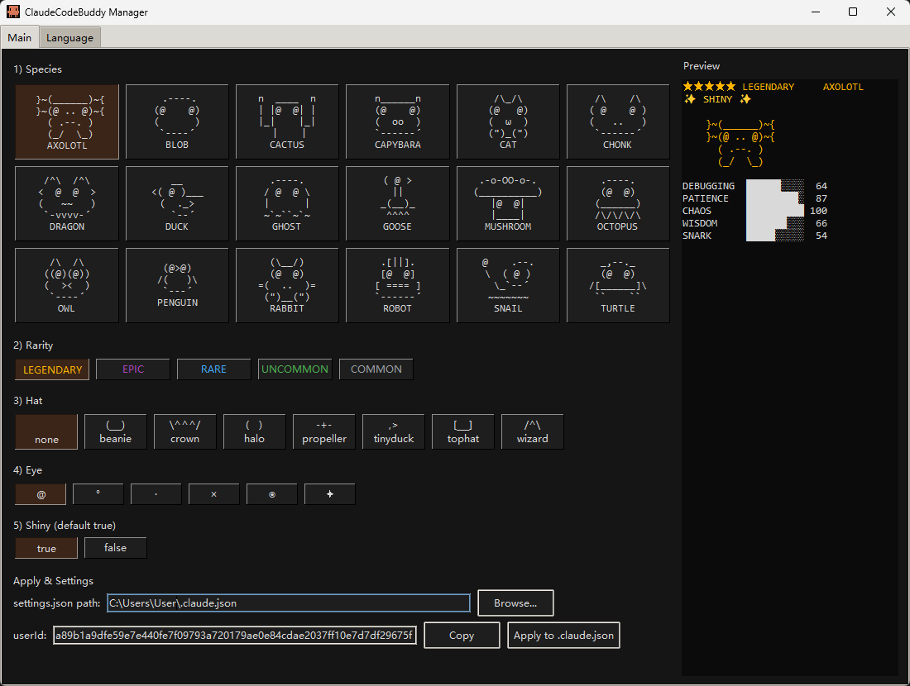
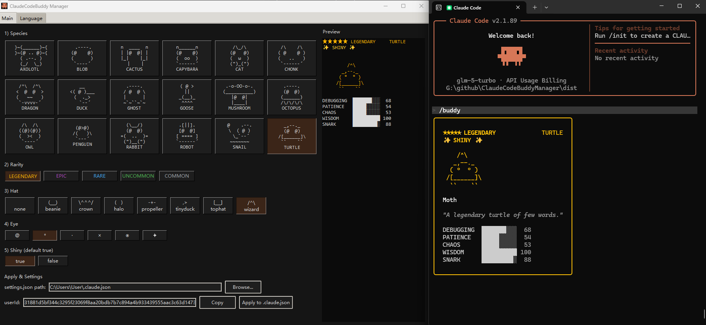

# ClaudeCodeBuddy Manager

[English README](./README.md)

一个基于 Tkinter 的桌面工具，用于筛选 buddy 记录、生成 `userId`，并一键写入 `.claude.json`。

## 功能特性

- 可视化筛选：`species / rarity / hat / eye / shiny`
- 实时预览角色外观与属性
- 一键复制 `userId`
- 一键应用到 `.claude.json`（更新 `userID` 并移除 `companion`）
- 内置多语言界面（含中文）

## 界面截图




## 项目结构

```text
.
├─ buddy_desktop_app.py
└─ dist/
   └─ ClaudeCodeBuddy-Manager-win-x64.exe
```

## 使用方式（Windows）

### 方式 1：直接运行可执行文件

1. 打开 `dist/ClaudeCodeBuddy-Manager-win-x64.exe`
2. 完成筛选条件
3. 点击应用按钮写入配置

### 方式 2：运行 Python 源码

```bash
python buddy_desktop_app.py
```

> 需要 Python 3.10+（推荐 3.11）

## 打包（Windows）

```bash
python -m pip install pyinstaller
python -m PyInstaller ClaudeCodeBuddy-Manager.spec
```

输出目录：`dist/`

## 注意事项

- 写入配置前会自动创建备份文件（`*.bak-时间戳`）
- 请先确认 `.claude.json` 路径正确再执行应用
- 如果要构建 macOS 版本，需要在 macOS 环境打包（PyInstaller 不支持在 Windows 直接打 Mac 包）
