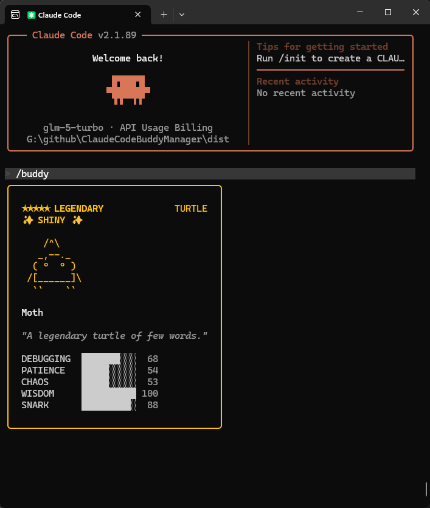

# ClaudeCodeBuddy Manager

[English README](./README.md)

一个面向 Claude Code 的桌面宠物指定器：可视化挑选宠物物种、稀有度与外观组合，自动生成对应 `userId`，并一键写入 `.claude.json`。

## 支持平台

- Windows：`dist/Window/ClaudeCodeBuddy-Manager-win-x64.exe`
- macOS：`dist/MacOS/ClaudeBuddyManager.app`

## 使用方式

### Windows

1. 运行 `dist/Window/ClaudeCodeBuddy-Manager-win-x64.exe`
2. 完成筛选条件
3. 点击应用按钮写入配置

### macOS

1. 打开 `dist/MacOS/ClaudeBuddyManager.app`
2. 完成筛选条件
3. 点击应用按钮写入配置

## 界面截图

